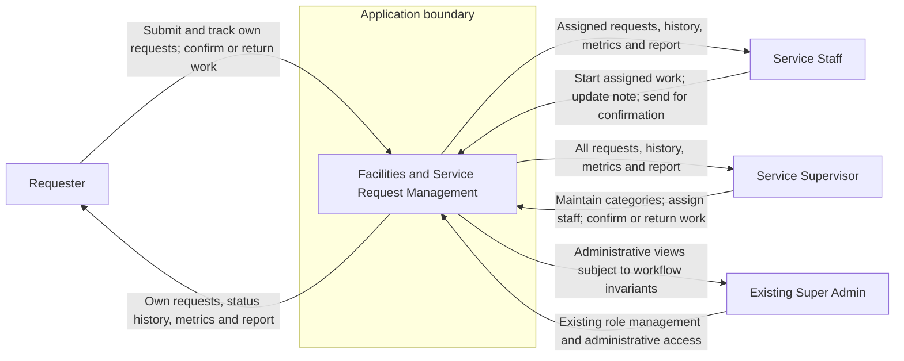
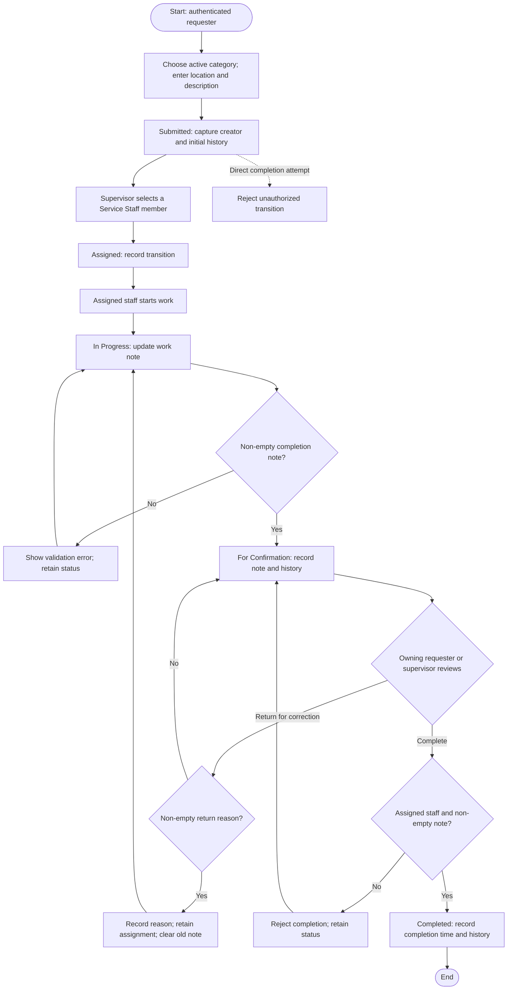
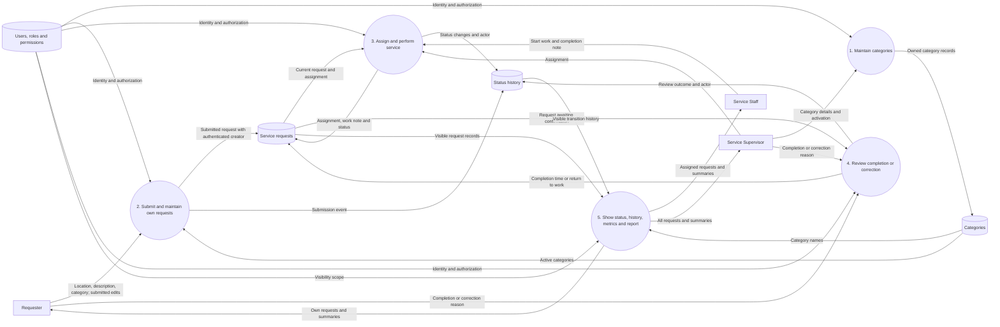

# Facilities MVP — implemented diagrams

These four diagrams describe the implemented MVP. The application uses the existing Laravel, Filament, Livewire, Shield and Spatie Permission stack. No external integrations participate in the facilities workflow.

## 1. System Context Diagram

## 2. Entity Relationship Diagram

This ERD reflects the final application schema from all current migrations. It includes the facilities domain, authorization, import/export, operational audit, and backup/restore tables. Laravel infrastructure tables with no facilities relationship (`password_reset_tokens`, `sessions`, `cache`, `cache_locks`, `jobs`, `job_batches`, and `failed_jobs`) are omitted for readability.

```mermaid
erDiagram
    users {
        bigint id PK
        string name
        string email UK
        timestamp email_verified_at "nullable"
        string password
        string status "default active"
        enum staff_status "default available"
        timestamp deactivated_at "nullable"
        bigint deactivated_by FK "nullable"
        string remember_token "nullable"
        timestamp created_at
        timestamp updated_at
        timestamp deleted_at "nullable"
    }
    service_categories {
        bigint id PK
        varchar_100 name UK
        text description "nullable"
        boolean is_active "default true"
        bigint created_by FK
        bigint updated_by FK "nullable"
        timestamp created_at
        timestamp updated_at
        timestamp deleted_at "nullable"
    }
    service_requests {
        bigint id PK
        varchar_50 request_no UK
        bigint service_category_id FK
        varchar_150 location
        text description
        enum status "submitted, assigned, in_progress, for_confirmation, completed"
        enum priority "low, normal, high, urgent, critical"
        timestamp needed_start_at "nullable"
        timestamp needed_end_at "nullable"
        timestamp scheduled_start_at "nullable"
        timestamp scheduled_end_at "nullable"
        bigint assigned_to FK "nullable"
        text completion_note "nullable"
        timestamp completed_at "nullable"
        bigint created_by FK "requester and owner"
        bigint updated_by FK "nullable"
        timestamp created_at
        timestamp updated_at
        timestamp deleted_at "nullable"
    }
    service_request_status_histories {
        bigint id PK
        bigint service_request_id FK
        varchar_30 from_status "nullable"
        varchar_30 to_status
        text remarks "nullable"
        bigint changed_by FK
        timestamp created_at
    }
    service_request_assignments {
        bigint id PK
        bigint service_request_id FK
        bigint staff_id FK
        bigint assigned_by FK
        timestamp assigned_at
        timestamp unassigned_at "nullable"
    }
    activity_logs {
        bigint id PK
        string subject_type "polymorphic"
        bigint subject_id "polymorphic"
        varchar_60 action
        text from_value "nullable"
        text to_value "nullable"
        text remarks "nullable"
        bigint changed_by FK
        timestamp created_at
    }
    system_backups {
        bigint id PK
        string filename
        string disk_path
        bigint size_bytes
        varchar_64 checksum_sha256 "nullable"
        varchar_20 status
        text error_message "nullable"
        bigint created_by FK
        timestamp created_at
    }
    system_restores {
        bigint id PK
        bigint system_backup_id FK
        varchar_20 status
        text error_message "nullable"
        bigint restored_by FK
        timestamp created_at
    }
    imports {
        bigint id PK
        timestamp completed_at "nullable"
        string file_name
        string file_path
        string importer
        integer processed_rows
        integer total_rows
        integer successful_rows
        bigint user_id FK
        timestamp created_at
        timestamp updated_at
    }
    failed_import_rows {
        bigint id PK
        json data
        bigint import_id FK
        text validation_error "nullable"
        timestamp created_at
        timestamp updated_at
    }
    exports {
        bigint id PK
        timestamp completed_at "nullable"
        string file_disk
        string file_name "nullable"
        string exporter
        integer processed_rows
        integer total_rows
        integer successful_rows
        bigint user_id FK
        timestamp created_at
        timestamp updated_at
    }
    roles {
        bigint id PK
        string name "unique with guard_name"
        string guard_name
        timestamp created_at
        timestamp updated_at
    }
    permissions {
        bigint id PK
        string name "unique with guard_name"
        string guard_name
        timestamp created_at
        timestamp updated_at
    }
    model_has_roles {
        bigint role_id PK,FK
        bigint model_id PK "polymorphic"
        string model_type PK
    }
    model_has_permissions {
        bigint permission_id PK,FK
        bigint model_id PK "polymorphic"
        string model_type PK
    }
    role_has_permissions {
        bigint permission_id PK,FK
        bigint role_id PK,FK
    }

    users o|--o{ users : deactivates
    users ||--o{ service_categories : creates
    users o|--o{ service_categories : last_updates
    users ||--o{ service_requests : requests_and_creates
    users o|--o{ service_requests : assigned_staff
    users o|--o{ service_requests : last_updates
    service_categories ||--o{ service_requests : categorizes
    service_requests ||--o{ service_request_status_histories : has
    users ||--o{ service_request_status_histories : changes
    service_requests ||--o{ service_request_assignments : has
    users ||--o{ service_request_assignments : staff
    users ||--o{ service_request_assignments : assigns
    users ||--o{ activity_logs : changes
    service_requests ||..o{ activity_logs : subject_polymorphically
    users ||..o{ activity_logs : subject_polymorphically
    users ||--o{ system_backups : creates
    system_backups ||--o{ system_restores : has
    users ||--o{ system_restores : restores
    users ||--o{ imports : initiates
    imports ||--o{ failed_import_rows : has
    users ||--o{ exports : initiates
    users ||..o{ model_has_roles : polymorphic_assignment
    roles ||--o{ model_has_roles : assigned_role
    users ||..o{ model_has_permissions : polymorphic_grant
    permissions ||--o{ model_has_permissions : granted_permission
    roles ||--o{ role_has_permissions : grants
    permissions ||--o{ role_has_permissions : granted_through_role
```

`model_id` in the Spatie pivot tables and `subject_type`/`subject_id` in `activity_logs` are polymorphic associations, not foreign-key constraints to one table. Spatie teams are disabled. `created_by` is the request owner; no duplicate `requested_by` column exists, and `location` remains a request string rather than a Location table. `service_request_assignments` is an append-only assignment history, while `service_requests.assigned_to` holds the current assignee. Category, request, and user records use soft deletes; the user model uses deactivation to preserve historical associations. Status history, activity logs, backup records, restore records, and assignment history are append-only at the model layer. PostgreSQL also checks that Completed requests have an assigned staff member and a non-whitespace completion note.

## 3. Process Flow Diagram

Every action checks role, ownership/assignment and current status on the server. Workflow actions lock and reload the request; request changes and history commit together. Completed is terminal. Submitted requests may be edited or soft-deleted by their owner (or an authorized existing super admin).

## 4. Level 0 Data Flow Diagram

